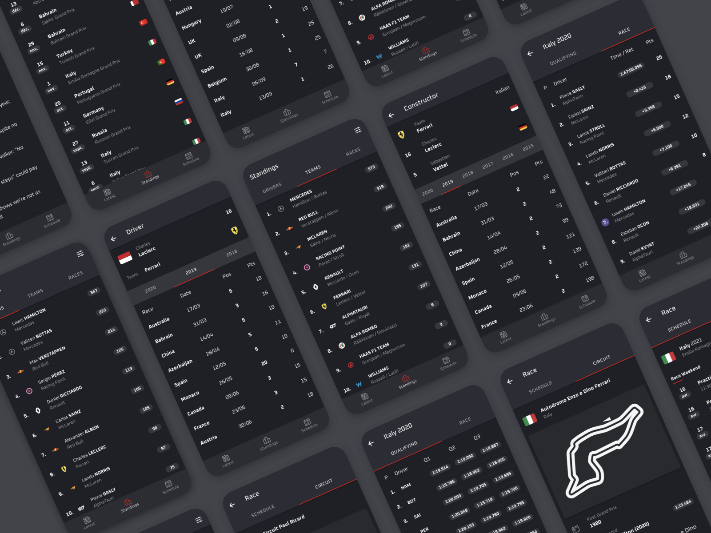

<div align="center">
  
</div>
<p align="center">Follow Formula 1 and access previous seasons</p>
<div align="center">


</div>

## :sparkles: Demo


## :package: Install

```bash
git clone https://github.com/dmartinjs/pitlane.git
cd pitlane
npm install
```

## :rocket: Start project

```bash
  npm run start
```

## :technologist: Built with

- [React](https://reactjs.org/)
- [Typescript](https://www.typescriptlang.org/)
- [Ionic](https://ionicframework.com/)
- [Capacitor](https://capacitorjs.com/)

## :page_with_curl: License
​
Copyright © 2021 [dmartinjs](https://github.com/dmartinjs).

Distributed under [AGPL-3.0](/LICENSE) license.